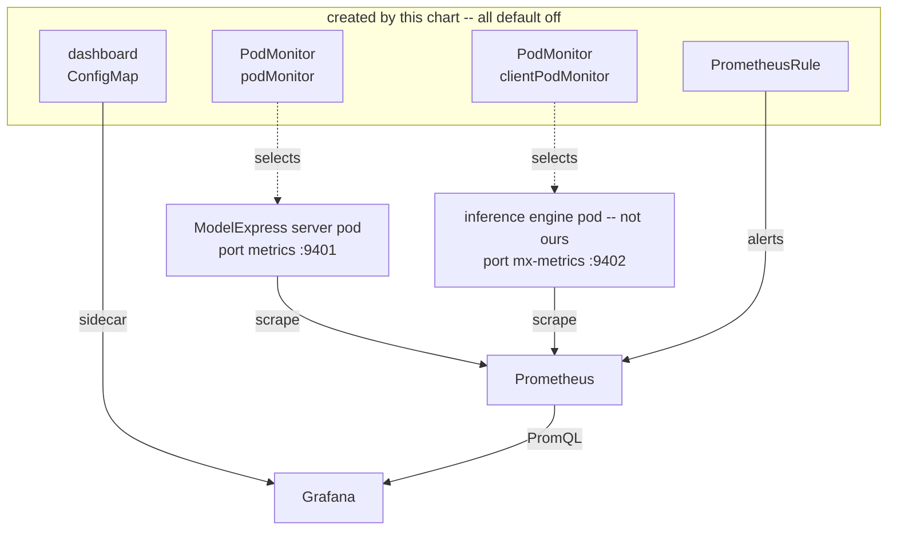

<!--
SPDX-FileCopyrightText: Copyright (c) 2025-2026 NVIDIA CORPORATION & AFFILIATES. All rights reserved.
SPDX-License-Identifier: Apache-2.0
-->

# Prometheus metrics

ModelExpress exposes Prometheus metrics from two places: the Rust server, on by
default, and the Python client, opt-in. This page covers how to scrape both,
what the pipeline guarantees, and the two operational choices it leaves to the
deployment.

This documents what ships today: the exposition path, `mx_build_info`, per-RPC
and storage-backend coverage on the server, the download lifecycle, NIXL client
health, the Kubernetes scrape, alerting and dashboard surface, and the first two
load-timing tiers — the `load_model()` window and the phases that partition it.

The tiers below those do not exist yet. Nothing here attributes time to an
individual strategy attempt or splits a transfer into registration, handshake
and wire, so the dashboard can say a load spent ninety seconds in `chain` but
not which strategy spent it or where inside the transfer it went.

---

## Quick start

### Server

Metrics are on by default on port **9401**, separate from the gRPC port.

```bash
curl -s http://<server>:9401/metrics | head
```

With the Helm chart, nothing to do — `metrics.enabled` defaults to `true` and
the chart generates the scrape annotations:

```yaml
metrics:
  enabled: true
  port: 9401
  podAnnotations: true   # emit prometheus.io/{scrape,port,path}
  service: false         # publish the port on the Service as well
```

To turn the listener off, `--set metrics.enabled=false`, or set
`MODEL_EXPRESS_SERVER_METRICS_PORT=0`.

### Client

Opt-in, and it needs three environment variables in the **pod manifest** — not
in code:

```yaml
env:
  - {name: MX_METRICS_ENABLED, value: "1"}
  - {name: PROMETHEUS_MULTIPROC_DIR, value: /tmp/mx-metrics}
  - {name: MX_METRICS_PORT, value: "9402"}
ports:
  - {name: mx-metrics, containerPort: 9402}
```

That is it. Every rank calls `enable_metrics()` from its engine loader; one of
them binds the port and serves the merged union of all of them.

No volume is required. The ranks are processes inside one container, so an
ordinary container path is already shared between them, and a container restart
recreates it empty — which is what a stale `.db` file would otherwise survive.
Mount a memory-backed `emptyDir` at the same path if you want tmpfs and a size
cap; then clear it at the container entrypoint with
`python -m modelexpress.metrics --reset`, because an `emptyDir` *does* persist
across container restarts.

A worked TP=8 example is
[`examples/p2p_transfer_k8s/client/vllm/vllm-single-node-metrics.yaml`](../examples/p2p_transfer_k8s/client/vllm/vllm-single-node-metrics.yaml)
— a metrics-enabled sibling of the stock single-node manifest, so the diff
between the two is exactly what metrics cost you.

Without the directory nothing breaks — the client falls back to
one-rank-per-endpoint and says so in a warning — but only one of your ranks is
then represented, which for TP=8 means losing seven eighths of the pod.

---

## Scraping on Kubernetes



**Creating these four objects is not the same as them being used.** The chart
owns the top row and nothing else; whether each object ever takes effect is
decided by a consumer the chart does not control, and each is gated differently:

| Object | Picked up by | Gate |
| --- | --- | --- |
| `podMonitor`, `clientPodMonitor` | Prometheus Operator | Labels must match the Prometheus CR's `podMonitorSelector` |
| `PrometheusRule` | Prometheus Operator | Labels must match its `ruleSelector` |
| dashboard `ConfigMap` | Grafana sidecar | Carries the sidecar's label, `grafana_dashboard` by default |

A gate that does not match is not an error. The object is created, `kubectl get`
shows it, nothing logs a complaint, and it is ignored for as long as it exists.
Every silent failure described in this section is that: a correctly created
resource that no consumer ever picked up.

Two discovery models exist and they do not overlap. Which one your cluster uses
decides everything below.

| Your Prometheus | Honours `prometheus.io/*` annotations | Honours PodMonitor |
| --- | --- | --- |
| `prometheus-community/prometheus` chart | yes, by default | no |
| **kube-prometheus-stack** (the Operator) | **no** | yes |

The chart defaults to annotations (`metrics.podAnnotations: true`). On an
Operator cluster those are inert, the endpoint is served and never visited, and
the result is indistinguishable from a crashed exporter. Set
`metrics.podMonitor.enabled=true` there instead.

```yaml
metrics:
  podAnnotations: false      # inert on the Operator; off avoids double-scraping
  podMonitor:
    enabled: true
    additionalLabels:
      release: kube-prometheus-stack   # see below
```

**The selector label is the trap.** kube-prometheus-stack defaults its
`podMonitorSelector` and `ruleSelector` to match only resources labelled with its
own Helm release name. A resource without that label installs cleanly, reports no
error, and is silently ignored forever.

The two selectors are configured independently and often differ in practice: it
is common to find `podMonitorSelector: {}`, which adopts every PodMonitor
regardless of labels, alongside a `ruleSelector` that still requires the release
label — so PodMonitors work while PrometheusRules are silently dropped. Check
both rather than assuming they match. If targets or alerts never appear, this is
almost always why:

```bash
kubectl get prometheus -A -o jsonpath='{range .items[*]}{.metadata.name}{"\n  pod:  "}{.spec.podMonitorSelector}{"\n  rule: "}{.spec.ruleSelector}{"\n"}{end}'
```

Leave both on only if you know your Prometheus honours exactly one. Where both
are honoured the same pod is scraped twice under different job labels, and every
`sum()` over the result double-counts.

### Client metrics need a second PodMonitor

The client is a library inside the inference engine's pod -- vLLM, TRT-LLM,
Dynamo -- which this chart does not deploy and cannot label. The server's
PodMonitor will never match those pods. They also use a different port name
(`mx-metrics` in the shipped example, against the server's `metrics`), so one
resource cannot cover both.

```yaml
metrics:
  clientPodMonitor:
    enabled: true
    portName: mx-metrics
    selector:
      matchLabels:
        app: mx-vllm-metrics    # whatever YOUR engine pods carry
```

The selector has no default and the chart refuses to render without one: an
empty PodMonitor selector matches every pod in the namespace rather than none.
There is no ModelExpress-owned label to fall back on, because the pod is not
ours -- the labels differ per manifest across `examples/`, and under a
`DynamoGraphDeployment` the operator generates them.

Pods on the `MX_METRICS_PUSHGATEWAY` path are not scraped at all and no selector
covers them.

## Why one endpoint per pod

A ModelExpress pod runs **one worker process per GPU**, and N is a customer
variable: this repository's own configurations span TP=1 through TP=8. Anything
that assumes one metrics-producing process per scrape target loses N-1 ranks.

So the client uses `prometheus_client` **multiprocess mode**. Each rank mmaps
per-PID files into a pod-local directory; one process binds the port and its
`MultiProcessCollector` serves the union of every rank, including ranks that have
already exited. Losing the bind is the *normal* case, not a failure, and mmap
writes are durable at increment time, so no exit hook is in the path — an
OOM-killed rank's counters still show up.

---

## The rules that are not style

Each of these has one failure mode, and it is silent in every case.

**`PROMETHEUS_MULTIPROC_DIR` goes in the pod manifest, never in Python.**
`prometheus_client.values.get_value_class()` latches at module import. An
in-process assignment lands after `import vllm` and produces zero `.db` files
with no error. `enable()` detects the latched-wrong state and logs an error
naming the cause, rather than serving an empty endpoint that returns 200.

**Never wipe the directory from worker code.** Ranks start staggered, so a late
rank's wipe unlinks an early rank's already-mmapped files; that rank keeps
writing to an unlinked inode and disappears from every later scrape. Wipe at the
container entrypoint only, with `python -m modelexpress.metrics --reset` — and
only if you mounted a volume, since an `emptyDir` survives container restarts
within a pod while a plain container path does not.

**`mx_build_info` is a Gauge set to 1, never an `Info`.** Under multiprocess
mode an `Info` writes no file, exposes nothing, and raises nothing. It would
pass its own health check while being invisible and silently emptying every
`group_left` join.

**Gauges need an explicit `multiprocess_mode`, and `livesum` is not safe here.**
The default, `all`, appends a `pid` label and is unbounded. `livesum` and
`liveall` depend on `mark_process_dead`, which only runs on a clean exit, so an
in-flight value wedges forever when a rank is OOM-killed. In-flight quantities
belong in `_started_total` / `_finished_total` counter pairs differenced in
PromQL, which self-heals.

**Push and scrape are mutually exclusive**, enforced in code. Running both
double-counts every series.

---

## Two choices the deployment has to make

### 1. Scrape cost versus counter monotonicity

`MultiProcessCollector` re-reads every mmap file in Python, holding the GIL,
inside the process driving the engine scheduler. Files for dead PIDs are never
reclaimed, so a pod that recycles workers accumulates them and scrape cost grows.

Reaping them bounds the cost but makes merged counters *decrease*, which
Prometheus reads as a reset and `rate()` then mis-accounts.

**ModelExpress does not reap.** Counters stay monotonic; bound pod lifetime
instead. Measured on an idle H200 node, the curve runs ~0.1 ms at one file set to
~2.4 ms at 256 — inside Prometheus's 10 s timeout, but taken without an engine
competing for the GIL, so treat it as a floor. If you recycle workers
aggressively, watch `scrape_duration_seconds` for the pod in Prometheus itself
rather than trusting that figure.

### 2. Sharing the directory with the engine's exporter

vLLM sets and manages `PROMETHEUS_MULTIPROC_DIR` itself, and the value class is
process-global, so a genuinely separate directory is not achievable from inside
the engine process.

**The decision is: share the directory, take a distinct port, never wipe it from
code.** ModelExpress families are namespaced `mx_*` and cannot collide with the
engine's. A scrape of the ModelExpress port will also carry the engine's series;
that is a superset, not a conflict. If you would rather scrape one port, point
both at the engine's.

---

## Families

`mx_build_info` is the join target for everything process-constant. Both halves
of the deployment export it, distinguished by `component`.

### Server

| Family | Type | Labels |
| --- | --- | --- |
| `mx_build_info` | Gauge (= 1) | `component="server"`, `version`, `backend`, `scheme` |
| `mx_grpc_requests_total` | Counter | `method`, `outcome` |
| `mx_grpc_request_seconds` | Histogram | `method`, `outcome` |
| `mx_grpc_requests_in_flight` | Gauge | `method` |
| `mx_backend_ops_total` | Counter | `store`, `op`, `result` |
| `mx_backend_op_seconds` | Histogram | `store`, `op`, `result` |
| `mx_backend_ops_in_flight` | Gauge | `store`, `op` |
| `mx_registry_status_transitions_total` | Counter | `from`, `to` |
| `mx_download_claims_total` | Counter | `result` |
| `mx_download_lease_refresh_total` | Counter | `result` |
| `mx_download_seconds` | Histogram | `outcome` |
| `mx_cache_evictions_total` | Counter | `reason` |
| `mx_registry_entries` | Gauge | `status` |
| `mx_state_entries` | Gauge | `map` |
| `mx_task_last_success_timestamp_seconds` | Gauge | `task` |

`method` is a closed set of the 21 routed RPCs plus `other`; an unrecognised path
cannot mint a series.

`outcome` includes `cancelled`, recorded from a drop guard when the caller goes
away before the handler finishes -- a client disconnect, an `RST_STREAM`, or a
deadline. Without it the gap would not be uniform: the requests most likely to be
cancelled are the slow ones, so the latency histogram would be conditioned on
completion and its tail would look healthy precisely because the slowest samples
were missing. A cancellation increments the counter only and writes no latency
sample, since a partial duration would enter the distribution as a fast one.

The two `_in_flight` gauges are the direct reading of the same situation: a store
that wedges while its peers serve normally shows up immediately as operations
accumulating, instead of having to be inferred from an absence of samples. They
are plain gauges rather than the `_started_total`/`_finished_total` counter pairs
the client side uses, because that pattern exists to survive a SIGKILLed rank
under multiprocess mode -- the server is one process with an in-process registry,
so there is nothing to wedge.

### The download lifecycle

`mx_download_claims_total{result="takeover"}` is the one to watch: a takeover
means a previous downloader died and the bytes are being pulled again, which for
a large model is hundreds of gigabytes of repeated transfer.
`mx_download_lease_refresh_total{result="lost"}` is its leading indicator.

Downloads currently in flight:

```promql
mx_registry_entries{status="downloading"}
```

Use the gauge, not a difference over the transition counters. The gauge is
recomputed from the registry itself, so it is correct across a restart and across
replicas; the counters are process-local while `DOWNLOADING` persists in the
store, so after a restart a download that began in the previous process
contributes a departure with no matching arrival and a raw difference can go
negative.

The transition counters answer flow rather than level -- how often downloads
start, and how often they end in error:

```promql
sum(rate(mx_registry_status_transitions_total{to="downloading"}[5m]))
sum(rate(mx_registry_status_transitions_total{to="error"}[5m]))
```

A `mx_registry_entries{status="downloading"}` that stays non-zero with no
`to="downloading"` rate underneath it is a model wedged in `DOWNLOADING`.

### Refreshed gauges, not scrape-time collection

`mx_registry_entries` and `mx_state_entries` are written by a background task on
`MX_REGISTRY_STATS_INTERVAL_SECS` (default 60), not computed during a scrape.
Counting registry entries walks the keyspace -- a `SCAN` plus a pipelined per-key
fetch on Redis, an unpaginated list of every `ModelCacheEntry` on Kubernetes -- so
collecting at scrape time would put that on the metadata store every fifteen
seconds.

The task is independent of cache eviction on purpose: that service ticks hourly
and is skipped entirely when eviction is disabled, which would leave these gauges
permanently absent rather than merely stale.

When a refresh fails the gauges hold their previous values and the heartbeat is
not stamped, so staleness is the signal:

```promql
time() - mx_task_last_success_timestamp_seconds{task="registry_stats_refresh"} > 300
```

`mx_registry_entries` counts *entries*, not models: one logical model holds
several at once, one per revision plus separate ones for metadata-only downloads.

**The two streaming RPCs are deliberately absent.** `EnsureModelDownloaded` and
`StreamModelFiles` return their response head as soon as the stream is set up and
report failure as a stream item or trailer, so recording at the head would show
`outcome="ok"` and a sub-millisecond duration for a download that ran for forty
minutes and failed. `Health/Watch` is excluded for the same reason. Timing these
means instrumenting the response body, which is a later change; until then they
are absent rather than wrong. `store` names the subsystem (`p2p`, `registry`, `refit`),
not the storage engine -- only one engine is live per pod, so the engine is
carried by `mx_build_info{backend=...}` and joined from there.

#### `outcome` is not the gRPC status code

Several handlers report failure *in band*: they return `Ok` carrying
`success: false`, or an empty list. `ListSources` is the clearest case -- a
backend outage and "no peers have published yet" are the same
`Ok(ListSourcesResponse { instances: [] })` on the wire.

A metric derived from the status code would therefore read 100% success straight
through a total backend outage. Instead each handler publishes its own verdict,
which the metrics layer prefers over anything it could infer:

```promql
# Backend outages, which a status-code-derived metric would report as success.
sum by (method) (rate(mx_grpc_requests_total{outcome="backend_error"}[5m]))
```

`backend_error` is wider than the metadata store: every `Unavailable` maps to it,
including the auth layer's when the Kubernetes TokenReview API is down. That case
appears on every method at once and can read like a total store outage, so
confirm against `mx_backend_ops_total{result="error"}` -- a real store outage
lights that family up too.

Handlers that fail honestly with `Err(Status)` need no such tag -- the status
carries itself -- so only the handlers that would otherwise misreport are
touched.

### Client

| Family | Type | Labels |
| --- | --- | --- |
| `mx_build_info` | Gauge (= 1) | `component="client"`, `version`, `scheme` |
| `mx_p2p_source_selections_total` | Counter | `policy`, `scheme` |
| `mx_p2p_source_attempts_total` | Counter | `policy`, `scheme`, `result` |
| `mx_p2p_metadata_lookup_failures_total` | Counter | `policy`, `scheme` |
| `mx_p2p_list_sources_total` | Counter | `policy`, `scheme`, `result` |
| `mx_p2p_candidates` | Histogram | `policy`, `scheme`, `stage` |
| `mx_p2p_source_selection_seconds` | Histogram | `policy`, `scheme` |
| `mx_p2p_transfer_seconds` | Histogram | `policy`, `scheme`, `outcome` |
| `mx_nixl_data_plane_errors_total` | Counter | `scheme`, `kind` |
| `mx_nixl_receive_total` | Counter | `scheme`, `result` |
| `mx_load_seconds` | Histogram | `engine`, `model`, `model_role`, `scheme`, `outcome` |
| `mx_load_phase_seconds` | Histogram | `engine`, `model`, `phase`, `scheme` |

### Load timing, and what it does not measure

`mx_load_seconds` is the `load_model()` window: what the caller waited on. It is
**not** the inference cold start. CUDA graph capture, JIT compilation and KV
cache setup all run after the loader returns, and Dynamo already measures the
whole thing end to end, so duplicating it here would produce a second number
that disagrees with the first for reasons nobody can see.

One consequence is worth stating plainly, because it is not obvious from the
phase list. `artifact_install` fetches vLLM's compile caches, and its whole
purpose is to save a JIT recompile — but that recompile happens *after* the
loader returns, outside this window. So these families show what the install
**cost** and never what it **saved**: a deployment can see `artifact_install`
take eight seconds and cannot tell from here whether that avoided two hundred
seconds of compilation or was pure overhead on a cache that missed.

Widening `mx_load_seconds` would not fix it. The compile is genuinely not inside
`load_model()`, and stretching the span to cover it would break the partition
below. The missing signal is a hit/miss counter on the install itself, which
does not exist yet.

`mx_load_phase_seconds` splits that window into phases that **partition** it —
each is a disjoint interval inside the load, so their sum is bounded by the
total by construction rather than by convention:

| Phase | What runs |
| --- | --- |
| `artifact_install` | Compile-cache artifacts fetched before the model exists |
| `model_init` | The engine builds the module with dummy weights |
| `chain` | The strategy chain fills those weights |
| `publish` | This rank offers itself as a source to the next one |

Not every engine has all four, and the missing ones are absences rather than
zeros:

| Engine | Phases | Why | Confirmed on |
| --- | --- | --- | --- |
| vLLM | all four | | hardware |
| SGLang | no `model_init` | SGLang builds the module and hands it to the loader | hardware |
| TRT-LLM | `chain` only | model arrives built; publishing happens in a separate call, outside this window | unit tests only |

TRT-LLM's row has not been observed on a GPU: CI builds worker images for vLLM
and SGLang but not for TRT-LLM, so there is no image carrying this code to run.
Treat its phase set as the intent rather than as a measurement.

SGLang's `transfer_engine` transport is a further gap in the same direction. It
never enters the strategy chain, so it records **`mx_load_seconds` and no phases
at all**. The partition still holds — zero is bounded by the total — but the
share panel reads 0% there, which under the rule above means "time is going
somewhere no phase covers". On that transport it does, and the panel is telling
the truth about instrumentation that has not been written yet.

**Do not add a phase from a second call site.** The partition is the property
that makes "which part was slow" answerable without the numbers contradicting
each other, and recording one phase twice inflates it while leaving the sum
looking sound. `test_phases_partition_the_load` asserts `sum(phases) <= total`
against real timings.

Measured on one GPU each, serving `Qwen/Qwen2.5-0.5B-Instruct` at TP=1 with no
peer, so the chain falls through in both cases. Seconds, with share of that
engine's load:

| Phase | vLLM | | SGLang | |
| --- | ---: | ---: | ---: | ---: |
| `mx_load_seconds` | 5.961791 | | 4.373961 | |
| `artifact_install` | 0.000014 | 0.00% | 0.000007 | 0.00% |
| `model_init` | 0.470551 | 7.89% | *absent* | |
| `chain` | 5.490047 | 92.09% | 4.371382 | 99.94% |
| `publish` | 0.000014 | 0.00% | 0.000014 | 0.00% |
| **sum of phases** | **5.960626** | **99.98%** | **4.371403** | **99.94%** |

`sum(phases) <= total` holds on both. The 1.16 ms and 2.56 ms unaccounted are
the loader's own work between phases — the "sums to under 1" case the share
panel exists to surface, at a magnitude that says the instrumentation is
complete rather than that a phase is missing.

**SGLang genuinely has no `model_init` series**, not a zero one: the phase does
not appear in its exposition at all, because SGLang builds the module and hands
it to the loader. An engine's phase set is a property of that engine, so
comparing one engine's phase against another's is only meaningful within the
share column.

`artifact_install` and `publish` in the microseconds are real readings rather
than broken ones on both engines: artifact transfer was off on these runs, and
`publish` hands work to a background thread, so it measures the handoff and not
the upload.

The same SGLang run also shows why `mx_load_seconds` is not the cold start. The
load took 4.37 s; CUDA graph capture and piecewise compilation afterwards took
26.35 s and 10.55 s, none of it inside this window.

A failed load is recorded, with `outcome="error"`, and so is a phase that
raises. Dropping either would omit exactly the observations someone goes looking
for, and would make the phases stop summing to the whole on the failed loads
being investigated.

The buckets are the hour-scale band, identical to the server's `buckets::XSLOW`
value for value — a cold DeepSeek-V3 load runs roughly forty minutes, and server
downloads and client loads get compared on the same dashboard, where quantiles
from differently-bucketed histograms are not comparable. A test parses
`buckets.rs` and fails if the two drift.

The band runs from 0.5 s, not from 5 s, and the difference is not cosmetic. With
a 5 s floor every fast load shared the bottom bucket, and `histogram_quantile`
interpolates linearly across it — so a load measured at 3.80 s reported a p50 of
2.50 and a p95 of 4.75. Those are `q * 5`, not readings. A small model, a warm
cache and a P2P transfer that works are all sub-5 s, so this was the common case
rather than an edge.

Quantiles still need observations to mean anything. A single load gives a p95
that is bucket interpolation whatever the boundaries are; these are fleet
statistics, and on one pod the mean per phase is the honest panel to read.

### The `model` label is bounded by convention, not by code

Every other label on these families is closed in code: an unrecognized `engine`
clamps to `other`, an unknown `phase` is dropped. `model` cannot be, because its
values are whatever the deployment chose to serve. It is bounded by the fact
that an organization runs a finite catalogue of models, changing on the
timescale of deployments rather than of requests.

It costs nothing in practice. A process serves exactly one model, so the label
is constant within a pod, and Prometheus already attaches `pod` to every series
— `model` names a dimension the data carries anyway rather than multiplying it.
Measured on a three-pod fleet: **18 series per pod either way**.

This is not the `source_worker_id` situation. That label was a uuid minted fresh
per process, so its domain grew with process count forever and it is off by
default for that reason. A model id is stable across restarts.

The guard is a 96-character cap, which can in principle merge two long ids that
share a prefix. That is accepted over dropping the label: a merged pair still
says more than no model at all, and 96 characters clears every id in the wild by
a wide margin. An absent or blank id records as `unknown` rather than as an
empty string, which would render as `model=""` and read as an exporter bug.

### NIXL data-plane health

`mx_nixl_data_plane_errors_total{kind}` counts the failures that demote an agent
from READY, classified as `timeout` or `status_error`. The distinction matters
because they fail differently: a `status_error` is NIXL reporting a failed
transfer, while a `timeout` is NIXL reporting *nothing at all* -- a wedged queue
pair neither completes nor transitions to ERR, so the timeout is the only
evidence anything went wrong.

The kind is assigned where the failure is constructed, not derived later. The
underlying field is a formatted message, so classifying at the consumer would
mean parsing prose into a label and the domain would grow with the wording.

`mx_nixl_receive_total{result}` records what a receive actually moved:

| result | meaning |
| --- | --- |
| `complete` | every locally registered tensor was filled |
| `partial` | a source/local name mismatch; the transfer completed and reported success, but the local-only tensors still hold their dummy values |
| `empty` | no tensors matched; returned success having moved nothing |
| `rejected` | strict mode refused the transfer and raised, rather than completing it |

`partial` and `empty` both return success to the caller and are logged only as
warnings, so before this they were indistinguishable from a healthy transfer.
`rejected` raises instead, and is counted so the family partitions every receive
rather than only the ones that returned.
A non-zero `partial` rate across a fleet means manifest drift between source and
target, which shows up later as wrong model output rather than as a failure.

Two changes to the client families are breaking for existing dashboards:

- **`source_worker_id` is off by default** on `mx_p2p_source_selections_total`.
  It is `uuid4().hex[:8]`, minted fresh per process, so its label domain grows
  with process count over time rather than with cluster size — unbounded series
  growth on any long-lived Prometheus watching a fleet with pod churn. Set
  `MX_METRICS_SOURCE_ID_LABEL=1` to restore it for a benchmark run; see
  [Selection skew](#selection-skew-and-the-source_worker_id-label).
- **`mx_p2p_list_sources_total` is new**, with `result` in
  `{ok, empty, error}`. Two things were previously indistinguishable: a
  metadata-backend outage and a healthy cluster that has published no peers.
  Both presented as an absence. Relatedly, `mx_p2p_candidates{stage="listed"}`
  can now observe **zero** — the selection funnel returned before recording
  anything when no instances came back, so the one bucket that separates "no
  peers published" from "peers listed but all filtered out" was unreachable.

### Selection skew and the `source_worker_id` label

*Is one source peer being picked disproportionately?* is the central question
when comparing selection policies, and the obvious way to answer it does not
survive a production fleet — the id is a per-process uuid, so its label domain
grows with process count over time.

**On a fleet, leave it off.** Note that a dashboard built as `sum by
(source_worker_id) (...)` does not error once the label is gone: PromQL groups
every sample under `source_worker_id=""`, so N lines become one and the panel
reads as perfectly balanced. Group by `policy` instead. Pinned matchers return no
data, and were already unreliable — the id was reminted on every process start.

**On a benchmark run, set `MX_METRICS_SOURCE_ID_LABEL=1`**, point it at a
Prometheus you are willing to throw away, and keep the run short enough that
process churn does not outgrow it. Then:

```promql
sum by (source_worker_id) (mx_p2p_source_selections_total)
  / ignoring(source_worker_id) group_left sum(mx_p2p_source_selections_total)
```

The call site always passes the peer id and the collector drops it unless the
variable is set, so the cardinality decision lives in one place. The label set is
latched when the family is built, so flipping the variable mid-process does
nothing — `prometheus_client` fixes a family's labels at construction.

For skew on a long-lived fleet the bounded form is a client-side gauge, which is
follow-on work. The same data is in the structured logs regardless:
`rdma_strategy` emits `source_worker_id=` on every source attempt.

### Useful queries

```promql
# Is the metadata backend down, or has nobody published weights?
sum by (result) (rate(mx_p2p_list_sources_total[5m]))

# Compare two benchmark runs. `scheme` is already a label on every client
# family, so this needs no join.
sum by (scheme) (rate(mx_p2p_transfer_seconds_sum[5m]))
  / sum by (scheme) (rate(mx_p2p_transfer_seconds_count[5m]))

# Attach a constant that is only on build_info (version), not on the family itself.
mx_p2p_list_sources_total
  * on (instance) group_left(version) mx_build_info{component="client"}

# Version skew across the fleet.
count by (version, component) (mx_build_info)

# Is anything scraping the server at all?
absent(mx_build_info{component="server"})
```

There is deliberately no `up{job="modelexpress"}` here. Nothing in this repo
produces that job label: annotation-based discovery files these targets under
whatever the Prometheus config calls its pod job (conventionally
`kubernetes-pods`), and under the Operator the `job` label is
`<namespace>/<podmonitor-name>`. (`podMonitor/<namespace>/<name>/0` is the
*scrape pool* name, which is what `/api/v1/targets?scrapePool=` takes; it is not
the `job` label.) Both are deployment-specific, so a query written against a
guessed job name matches nothing and reads as "no problems".
`mx_build_info` is registered unconditionally at startup for exactly this
purpose, and carries no such dependency.

`scheme` is on `mx_build_info` **and** on every client `mx_p2p_*` family, so a
`group_left(scheme)` join against `mx_build_info` copies a value the left side
already has. Use `scheme` directly. On the server it is on `mx_build_info` only.
Consolidating the client families onto the join is a follow-on taxonomy change.

---

## Alerts

`metrics.rules.enabled=true` ships a `PrometheusRule`. Client alerts are behind a
second flag (`metrics.rules.client`) because they fire on series that only exist
when the client is enabled *and* P2P is in use; a server-only deployment would
otherwise carry alerts that can never fire.

Alerts only, no recording rules. Recording rules would make the dashboard depend
on this resource being installed, so a site that enabled the dashboard and not
the rules would get empty panels and no error.

| Alert | Means | First thing to check |
| --- | --- | --- |
| `MXServerMetricsAbsent` | Nothing is scraping the server | The selector label above, before assuming the pods are down |
| `MXRegistryStatsStale` | The refresh task stopped succeeding | Whether the metadata backend is reachable |
| `MXDownloadLeaseLost` | A downloader stopped heartbeating | Expect `MXDownloadTakeover` next |
| `MXDownloadTakeover` | A model is being pulled again from scratch | Why the previous downloader died |
| `MXDownloadWedged` | Entries stuck in `DOWNLOADING` | `MXRegistryStatsStale` first -- a frozen gauge looks identical |
| `MXDownloadFailureRatio` | Downloads erroring | Upstream reachability, disk |
| `MXGrpcErrorRatio` | Errors on one method | If *every* method fired, see below |
| `MXBackendErrorRatio` | One storage subsystem erroring | `store` is the subsystem, not the engine |
| `MXBackendOpsStuck` | Operations in flight, none completing | The store named in the label |
| `MXStateEntriesGrowing` | A never-evicted in-process map is large | Whether the pod is heading for OOM |
| `MXNixlSilentReceiveFailures` | Transfers returning partial or empty data | These report *success* -- see below |
| `MXNixlDataPlaneErrors` | NIXL timeouts or status errors | RDMA fabric, `UCX_LOG_LEVEL=DEBUG` |
| `MXP2PListSourcesErrors` | Source lookups failing on the client | Server reachability from the engine pod |

Three of these are easy to misread:

**`MXGrpcErrorRatio` on every method at once is probably not the store.**
`outcome="backend_error"` absorbs every `Code::Unavailable`, including the one
the ServiceAccount token review returns when the Kubernetes API is unreachable.
That lights up every method simultaneously and looks like a total metadata
outage. A real store outage also raises
`mx_backend_ops_total{result="error"}` -- if that is flat, suspect auth.

**`MXNixlSilentReceiveFailures` is the only signal for its failure mode.**
`partial` and `empty` receives return success to the caller. A model loaded from
a partial receive is silently wrong rather than failed, so there is nothing else
to notice.

**`MXDownloadWedged` reads a refreshed gauge.** `mx_registry_entries` is written
by a background task, and on a failed pass it keeps its previous values. Rule out
`MXRegistryStatsStale` before treating the level as current.

### Dashboard

`metrics.dashboard.enabled=true` ships `helm/dashboards/modelexpress.json` as a
ConfigMap for the Grafana sidecar to discover. Adjust `metrics.dashboard.label`
if your sidecar watches something other than `grafana_dashboard`.

It covers the server end to end -- gRPC, storage backend, download lifecycle,
capacity -- and the client down to total transfer time. It does **not** yet plot
the load tiers: `mx_load_seconds` and `mx_load_phase_seconds` exist as of this
change but have no panel, so a load's phase split is queryable and not yet
visible. Below the phase level there is still nothing — the transfer panel can
say a transfer took 90 seconds but not where inside it the 90 seconds went.

Read **Overview** first; the rows below it answer *why* once a tile is not green.

| Row | Answers | Panels |
| --- | --- | --- |
| **Overview** | Is anything wrong right now? | 8 stat tiles |
| **Downloads** | Is the primary job working, and how fast? | 6 |
| **Server internals** | gRPC and storage backend: rate, errors, p99, in flight | 8 + 1 note |
| **P2P clients** | Selection funnel, transfer time, NIXL health | 8 + 1 note |
| **Capacity** | Map growth, evictions, version skew | 3 |

Six of the eight Overview tiles are coloured by the same condition an alert fires
on, and each tile's description names its alert:

| Tile | Alert |
| --- | --- |
| Server replicas exporting | `MXServerMetricsAbsent` |
| Registry stats age | `MXRegistryStatsStale` |
| Download failures | `MXDownloadFailureRatio` |
| Takeovers | `MXDownloadTakeover` |
| Leases lost | `MXDownloadLeaseLost` |
| gRPC errors | `MXGrpcErrorRatio` |

The other two -- downloads in flight, downloads completed -- are uncoloured
context.

Overview is **not** a complete alert summary. The seven remaining alerts in the
table above have no tile and are read from the panels in their own rows. It
covers the server's primary job, not the whole rule set, so do not treat an
all-green Overview as an all-clear.

`ModelService/EnsureModelDownloaded` is absent from every gRPC panel by design
(see the exclusion above); download latency lives in `mx_download_seconds`
instead. The dashboard carries a text panel saying so, because the alternative is
a reader concluding downloads are instantaneous.

## Environment variables

### Server

| Variable | Default | Meaning |
| --- | --- | --- |
| `MODEL_EXPRESS_SERVER_METRICS_PORT` | `9401` | `/metrics` port. `0` disables the listener. |
| `MX_METRICS_SCHEME` | `""` | Benchmark run label on `mx_build_info`. |

`MODEL_EXPRESS_SERVER_METRICS_PORT` is read **only** through the clap
`--metrics-port` override. The layered config loader builds its environment
source as `Environment::with_prefix("MODEL_EXPRESS").separator("_")`, so this
name resolves to the key path `server.metrics.port`, matches no field, and is
dropped by serde without a warning. In a config file the field is
`server.metrics_port`.

### Client

| Variable | Default | Meaning |
| --- | --- | --- |
| `MX_METRICS_ENABLED` | `0` | Master switch. |
| `PROMETHEUS_MULTIPROC_DIR` | unset | Shared per-pod directory. Required for multi-rank pods. |
| `MX_METRICS_PORT` | unset | `/metrics` port. One rank binds; it serves them all. |
| `MX_METRICS_PUSHGATEWAY` | unset | Batch-pod escape hatch. Mutually exclusive with `MX_METRICS_PORT`. |
| `MX_METRICS_SCHEME` | `""` | Benchmark run label. Carried on `mx_build_info` and on every `mx_p2p_*` family — see the family table above. |
| `MX_METRICS_BIND_RETRY_SECS` | `15` | How often a rank that lost the bind re-attempts it, so endpoint ownership migrates when the winner exits. |
| `MX_METRICS_SOURCE_ID_LABEL` | `0` | Restore the per-peer `source_worker_id` label. **Benchmark runs only** — the id is a per-process uuid, so its label domain grows with process count over time. See [Selection skew](#selection-skew-and-the-source_worker_id-label). |

The client needs `prometheus-client`, which is the `metrics` extra:

```bash
pip install "modelexpress[metrics]"
```

In practice the engine images already provide it — vLLM, SGLang and TensorRT-LLM
all depend on it for their own metrics — so the extra matters only for an image
built without one of those. If it is missing the collector catches the
`ImportError` and disables itself, so the symptom is `up == 0` with nothing else
to go on.

---

## Diagnosing an endpoint that returns nothing

| Symptom | Likely cause |
| --- | --- |
| `up == 0` on server pods | Scrape is aimed at the gRPC port. tonic is HTTP/2 only; use `metrics.port`. |
| `up == 0` on worker pods | `MX_METRICS_ENABLED` is unset, or `prometheus-client` is missing from the image. The engine images ship it; an image built without one needs `modelexpress[metrics]`. |
| 200 with no `mx_*` series | `PROMETHEUS_MULTIPROC_DIR` was set after `prometheus_client` was imported. Check the logs for the "no .db files were written" error. |
| Only one rank's numbers | `PROMETHEUS_MULTIPROC_DIR` is not set, so there is nothing to merge. |
| A rank vanishes mid-run | Something wiped the directory after ranks started. Only the entrypoint may do that. |
| Scrapes time out | Dead-PID file sets have accumulated. See "Scrape cost" above. |
| `mx_build_info` present, nothing else | Working as intended: the exporter came up and this run recorded no events. |

---

## Verification

```bash
# Client pipeline, per issue.
cd modelexpress_client/python
pytest tests/test_metrics.py tests/test_metrics_deployment.py -v

# Selection funnel and the ListSources outcome counter.
pytest tests/test_source_selection.py -v

# Server registry, build info, and the config wiring.
cargo test --package modelexpress-server metrics

# The listener itself, scraped over real HTTP/1.1. Gated behind the feature, so
# the command above does NOT run it.
cargo test --package modelexpress-server --features integration-tests --test in_process_server
```

`tests/test_metrics.py` runs the merged-endpoint check at both TP=2 and TP=8 by
forking real ranks, SIGKILLing them, and asserting the merged total. That is the
exit criterion for this phase: one port exposing merged series from every rank,
surviving a hard kill.
