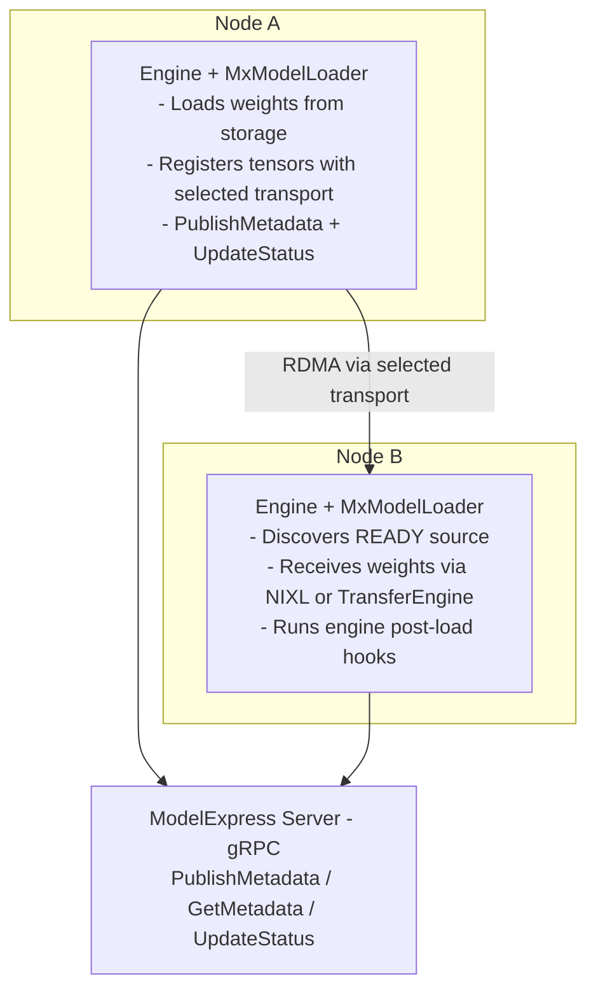

# Kubernetes P2P Weight Transfer Examples

This example demonstrates how to set up ModelExpress for P2P GPU weight transfers between inference engine replicas on Kubernetes. For the broader deployment guide and environment variable reference, see [`docs/DEPLOYMENT.md`](../../docs/DEPLOYMENT.md). For NIXL architecture details, see [`docs/ARCHITECTURE.md`](../../docs/ARCHITECTURE.md).

## Architecture



### Key Design Points

1. **Engine loader integration**: vLLM 0.23.0 uses its native `--load-format modelexpress`; `mx` is a backward-compatible alias. SGLang uses `remote_instance` with backend `modelexpress`. TensorRT-LLM uses native `checkpoint_format="MX"`.
2. **MxClient**: All gRPC communication goes through `MxClient` (workers never access Redis directly).
3. **Engine post-load hooks**: The ModelExpress adapter handles engine-specific post-load processing and tensor discovery.
4. **Tensor Parallelism**: Full TP support with rank-matched transfers. NIXL uses one agent per GPU; TransferEngine publishes one session per SGLang worker.

## Prerequisites

1. Kubernetes cluster with GPU nodes (H100/H200 recommended)
2. InfiniBand network between nodes for optimal performance
3. NVIDIA drivers and CUDA toolkit
4. Container images with NIXL and ZMQ support

## Deployment

### 1. Create HuggingFace Token Secret

```bash
kubectl create secret generic hf-token-secret --from-literal=HF_TOKEN=<your-token>
```

### 2. Choose a Metadata Backend and Deploy the Server

See [`server/`](server/) for backend-specific server manifests:
- **Redis**: [`server/redis_backend/`](server/redis_backend/)
- **Kubernetes CRD**: [`server/kubernetes_backend/`](server/kubernetes_backend/)

### 3. Deploy Clients

See [`client/`](client/) for engine deployment manifests:
- **Single-node** (TP only): [`client/vllm/vllm-single-node.yaml`](client/vllm/vllm-single-node.yaml)
- **Multi-node** (TP + PP): [`client/vllm/vllm-multi-node.yaml`](client/vllm/vllm-multi-node.yaml)
- **SGLang single-node NIXL**: [`client/sglang/sglang-single-node-p2p.yaml`](client/sglang/sglang-single-node-p2p.yaml)
- **SGLang single-node Mooncake TransferEngine**: [`client/sglang/sglang-single-node-transfer-engine.yaml`](client/sglang/sglang-single-node-transfer-engine.yaml)
- **TensorRT-LLM single-node per replica**: [`client/trtllm/trtllm-single-node-p2p.yaml`](client/trtllm/trtllm-single-node-p2p.yaml)

The ModelExpress loader checks the MX server on startup. If a ready source exists, it receives via RDMA. Otherwise it loads from storage and becomes a source for future nodes.

The vLLM client Dockerfile is pinned to vLLM 0.23.0, and the standard single-node and multi-node manifests use DeepSeek-V4-Pro.

For SGLang, `lmsysorg/sglang:v0.5.13.post1` is the known-good release image
with the upstream ModelExpress delegation hook.

For TensorRT-LLM, the current beta path supports `LlamaForCausalLM` with
TP=4 and native `checkpoint_format="MX"`. See
[`client/trtllm/README.md`](client/trtllm/README.md) for image build and
deployment instructions.

For ModelStreamer-only startup examples that stream weights from Azure Blob Storage, S3, or a local PVC, see [`../model_streamer_k8s/`](../model_streamer_k8s/).

### Optional: client Prometheus metrics

Client metrics are opt-in and off by default. To try them, deploy
[`client/vllm/vllm-single-node-metrics.yaml`](client/vllm/vllm-single-node-metrics.yaml)
instead of the standard single-node manifest — it is the same fleet plus the
four things metrics need, each marked `# metrics:` in the file.

The one part that is not obvious: a TP=8 pod runs eight worker processes, and
`prometheus_client` needs a shared directory (`PROMETHEUS_MULTIPROC_DIR`) for one
endpoint to serve all of them. Any writable container path works — the ranks
share the container filesystem — but it has to be set in the manifest rather than
in code, because `prometheus_client` fixes its value class at import and an
in-process assignment lands too late to take effect. Without it nothing breaks;
the client falls back to one endpoint per rank and warns, so only one of the
eight is represented.

The engine images already ship `prometheus-client`, so no image change is needed.
See [`docs/METRICS.md`](../../docs/METRICS.md) for the families, the PromQL, and a
diagnosis table.

## Environment Variables

### Client Container

| Variable | Description | Example |
|----------|-------------|---------|
| `MX_SERVER_ADDRESS` | ModelExpress server address used by the engine integration (recommended). `MODEL_EXPRESS_URL` is deprecated and pending removal; keep it only for legacy paths that have not switched to `MX_SERVER_ADDRESS`. | `modelexpress-server:8001` |
| `MX_RDMA_NIC_PIN` | Per-rank NIC pinning for RDMA-capable deployments | `auto` |
| `MX_P2P_METADATA` | P2P metadata exchange is enabled by default; set to `0` to route full metadata through the central server | `1` |
| `MX_ARTIFACT_TRANSFER` | Transfer compatible vLLM JIT cache artifacts; enabled in the vLLM examples | `1` |

### ModelExpress Server

| Variable | Description | Default |
|----------|-------------|---------|
| `MX_METADATA_BACKEND` | Backend type: `redis` or `kubernetes` | (required) |
| `REDIS_URL` | Redis connection URL (redis backend) | `redis://localhost:6379` |

## Performance Expectations

| Model | Size | TP | Transfer Time | Throughput |
|-------|------|-----|---------------|------------|
| Llama 3.1 70B | ~140GB | 4 | ~4-5s | ~300 Gbps |
| Llama 3.1 405B | ~750GB | 8 | ~25s | ~300 Gbps |

## Troubleshooting

### Check ZMQ sockets are created

```bash
kubectl exec -it deployment/mx-vllm -c vllm -- ls -la /tmp/mx/
```

### Check vLLM logs

```bash
kubectl logs deployment/mx-vllm -c vllm
```

### Check Redis connectivity (Redis backend)

```bash
kubectl exec -it deployment/modelexpress-server -c redis -- redis-cli ping
```

### Verify InfiniBand is working

```bash
kubectl exec -it deployment/mx-vllm -c vllm -- ibstat
```

### Check UCX configuration

```bash
kubectl exec -it deployment/mx-vllm -c vllm -- ucx_info -d
```

## License

Apache-2.0
